# Shayan Barghaman

*iOS developer, coding with Swift, always looking forward to learn new stuff!*

## About Me

Graduated with hardware engineer degree from Semnan university. I started to learn swift at 2017. In the middle of 2018 I released my first app: Yadavar, a simple to-do list app with highly customized UI which use Shamsi calendar. Soon later I started my second project, ComicKhan: an app for reading and organize comic files in iPhone and iPad. It’s been my main personal project since then and trying to keep it updated and getting it better day by day. In the middle of the 2020 I got hired by a client and started to build their app, Rewardo: an iOS client app, back-ended by a server for creating and participating in challenges and quizzes.

iOS and Swift Related projects that I've done so far:

 * [ComicKhan](#comickhan)
 * [YadAvar](#yadavar)
 * [Rewardo](#rewardo)
 * [Resimage](#resimage)
 * [SuperHeroUI](#superheroesui)
 * [SegmentedPageViewController](#segmentedpageviewcontroller)
 

 ## ComicKhan

An app for reading comic files with .cbz , .cbr, .pdf formats.

<table>
  <tr>
    <td>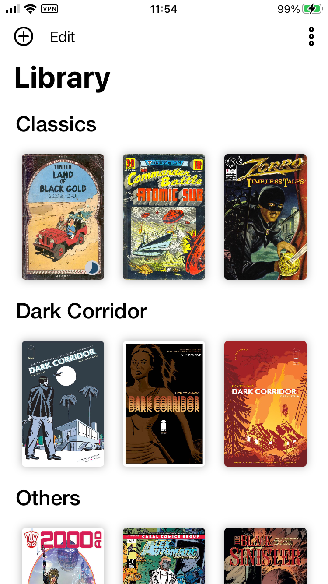</td>
    <td>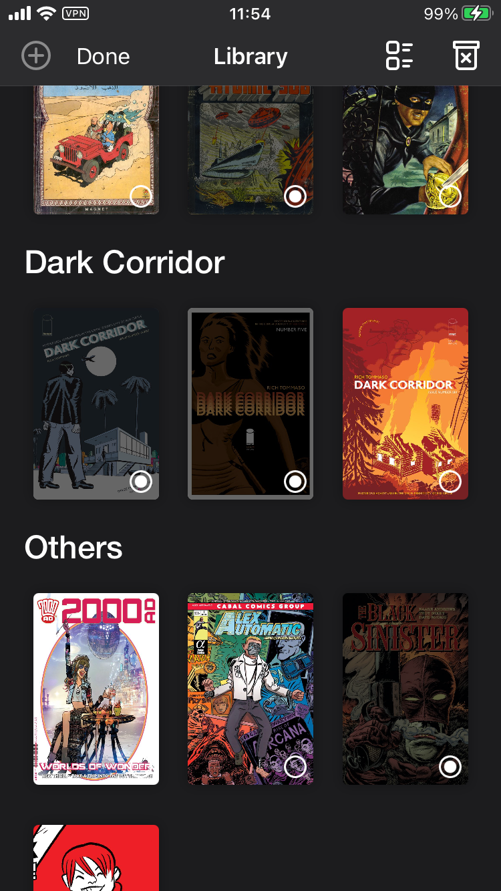</td>
    <td>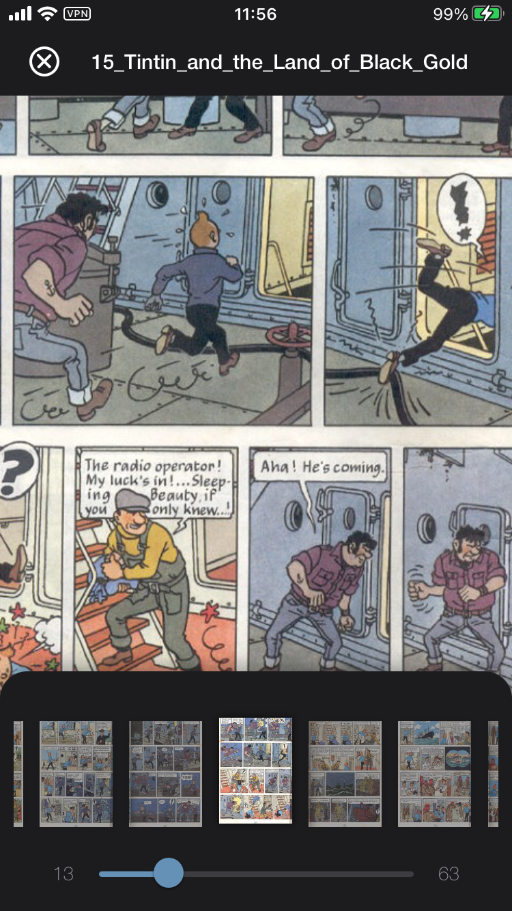</td>
  </tr>
 </table>
 <table align="center">
 <tr>
    <td>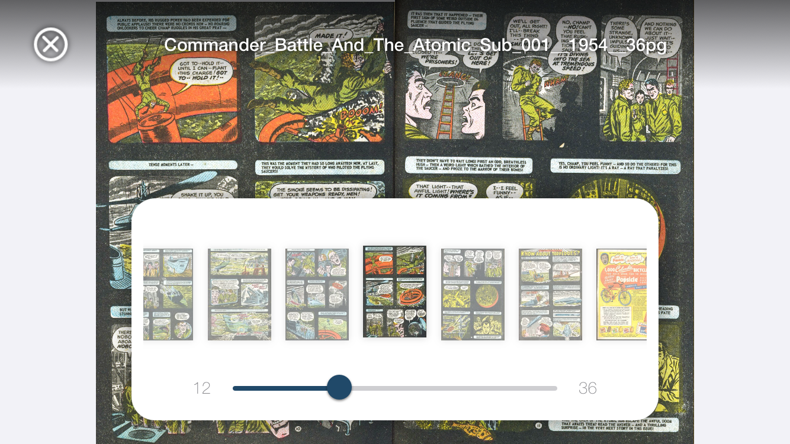</td>
  </tr>
 </table>

🛠Technologies that been used: `Swift`, `CoreData`, `MVC` ,`FileManager`, `XCTest`, `CocoaPods`

### ✅ Things that I learned:

* More advance CoreData: using NSfetchResultController to automatically commit CoreData changes into UI,
Learn how to use CoreData relations between entities. How to rewrite the CoreData stack from scratch that use in memory storage for testing purposes. How to use ValueTransformer to store custom NSObjects in CoreData.

* How to work with FileManager: create directories, copy and paste files, get directory contents, …

* What is MVC and how to use it for separating your logic codes from your view codes and write your logic into separated classes that makes testing much easier.

* Basic usage of XCTests for writing unit tests.

* How to build a whole ViewController UI programmatically without using storyboards.

* How to build a responsive UI which renders differently based on device is iPhone or iPad its rotation.

* How to use CocoaPods to install libraries that I need for unarchiving ZIP and RAR files.

* How to publish an app on the Appstore.

### 😬 Challenges:

* NSFetchResultController sectioning and sorting based on entity relations sometimes not working, and It’s a little bit limited for sorting based on multiple factors.

* Understanding the CoreData stack and how its components related together.

* Learning How to use memory graph for resolving memory issues. 

### ⬇️ Download
* [**Appstore**](https://apps.apple.com/us/app/comickhan/id1516810943)
* [**Github**](https://github.com/shaysugg/ComicKhan)

 
## Yadavar
My first project, a farsi todo-list app which using Shamsi calendar to save todos. It also has multiple themes that you can use to change the app appearance.

<table>
  <tr>
    <td>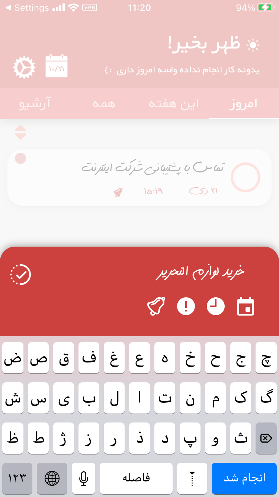</td>
    <td>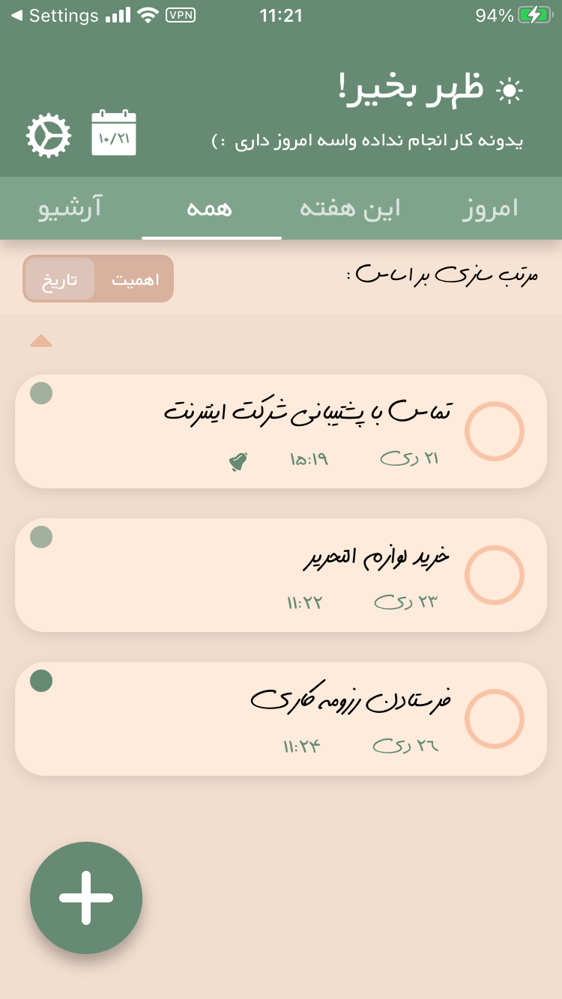</td>
    <td>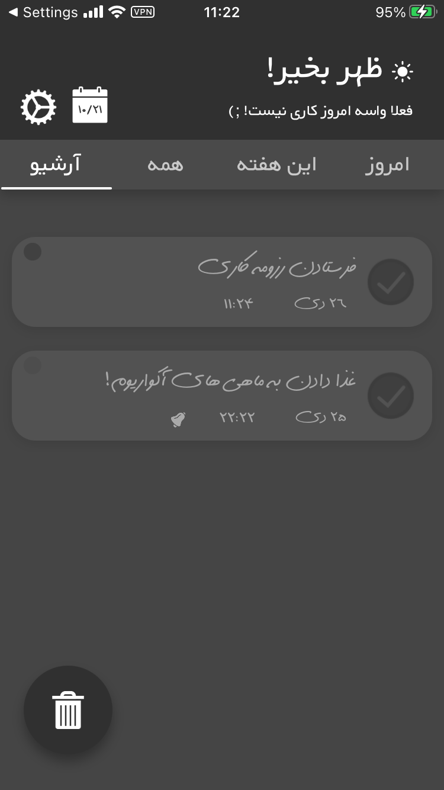</td>
  <tr>
</table>

 🛠Technologies that been used: `Swift`, `CoreData`

### ✅ Things that I learned: 
* How to build an iOS app from 0 to 100
* Basic use of storyBoard for adding UI elements to screen and then highly customise storyboard elements with code
* Basic knowledge of how using CoreData. fetching with NSfetchRequest, filtering with NSpredicate and lightweight migration.
* How to use local notification. set and trigger them programmatically.

### 😬 Challenges:
* Don’t know enough about MVC then. So codebase became a little bit messy and hard to maintain and update.

### ⬇️ Download:
*[Project archived - Unfortunately don't have enough time to update it anymore.]*
* [**Sibapp**](https://sibapp.com/applications/Yadavar)

## Rewardo

*[Project is still on development and not fully completed yet.]*

I got hired by a team of developers who's been working on a project that calls Rewardo. I was responsible for writing and maintaining the iOS client app. It uses REST api to connect with backend server. The app allows users to sign-up, create challenges, participate in other users challenges and win prizes.

🛠Technologies that been used: `Swift`, `MVVM`, `RXSwift`, `Alamofire`, `SwiftPackageManager`, `XCTest`

### ✅ Things that I learned:

* How to send all different types of requests, HTTP, download and upload using Alamofire.

* Basic knowledge about reactive programming and How to use RXSwift and RXCocoa and RXSwift Transformation operators.

* How Use MVVM to separate logic codes from UI codes and how to bind View changes to ViewModels and vice versa using RXSwift and RXCoacoa.

* Fully mastered on building the whole app UI programmatically without using storyboard.

* Avoid writing unnecessary constraint setup codes by using StackViews.

* How to use SwiftPackageManager to install libraries instead CocoaPods.

* How to build an asynchronous Image Loader which store images that fetched in a local cache to prevent extra internet data usage.

* Getting more familiar with using Git branching techniques.

### 😬 Challenges:

* Advance Alamofire like network error handeling, refreshing tokens, sending form data.

* Write a wrapper for working with NSkeychain and encrypt critical data.

* App has a lots of ViewModels and managing their dependencies and deciding when to break classes to small classes was challenging.

## Resimage

A command line tool for resizing and compressing images.

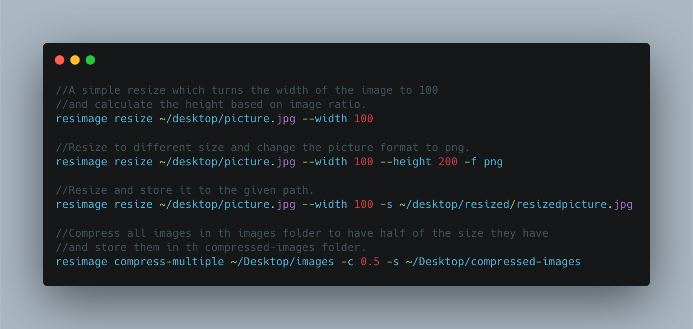

🛠Technologies that been used: `Swift`, `SwiftPackageManager`, `CoreGraphics`

### ✅ Things that I learned:
* How to build a simple command line utility using swift
* How to use CoreGraphics for resizing Images and saving them to disk.

### ⬇️ Download
* [**Github**](https://github.com/shaysugg/Resimage)

## SuperHeroesUI

A small app that I wrote to get more familiar with SwiftUI and Combine. It lets you search through superheroes and save your favorite ones.

<table>
    <tr>
        <td>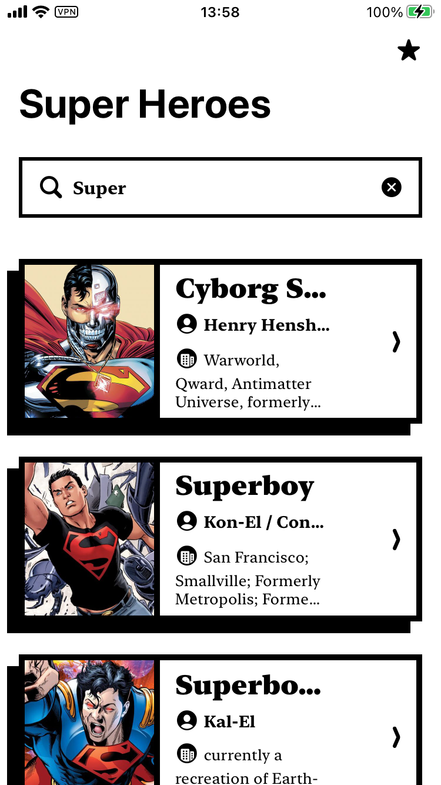</td>
        <td>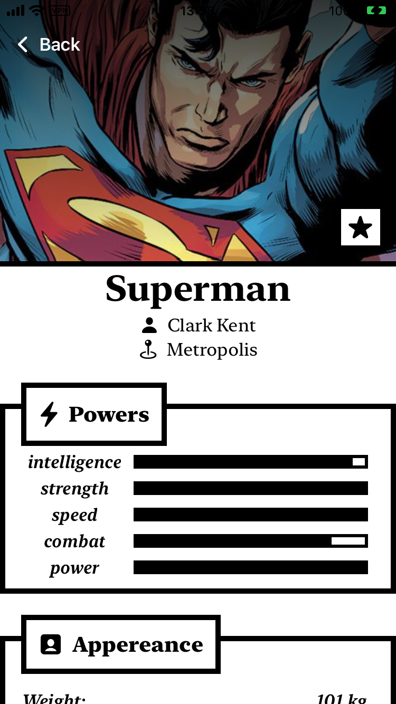</td>
        <td>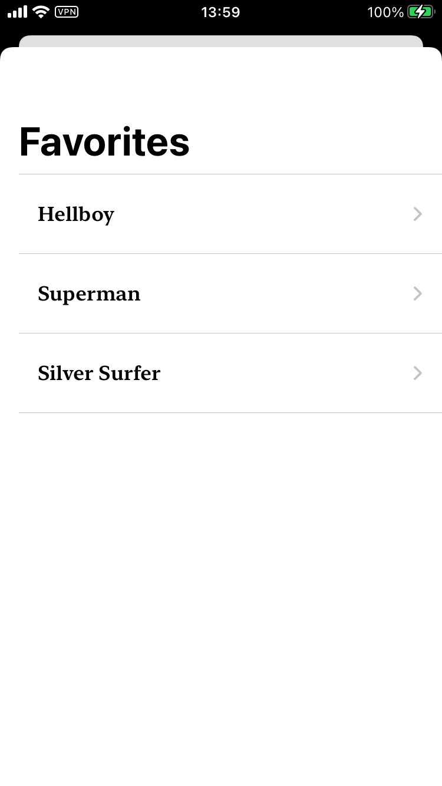</td>
    </tr>

</table>

Technologies that been used: `Swift`, `SwiftUI`, `Combine`

### ✅ Things that I learned:
* How to make a customised UI using SwiftUI
* How to bind SwiftUI views with ViewModel classes using Combine.
* How to use Combine publishers.

### ⬇️ Repo
* [**Github**](https://github.com/shaysugg/SuperHerosUI)

## SegmentedPageViewController

A UIPageViewController synced with a custom SegmentedControll.

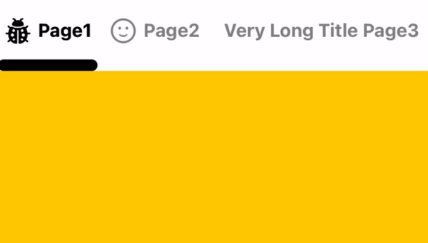

🛠Technologies that been used: `Swift`, `UIKit`

### ⬇️ Repo
* [**Github**](https://github.com/shaysugg/SegmentedPageViewController)